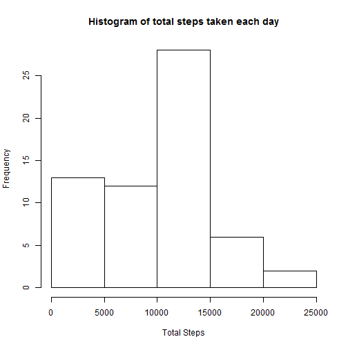
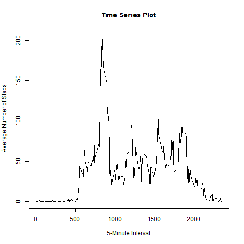
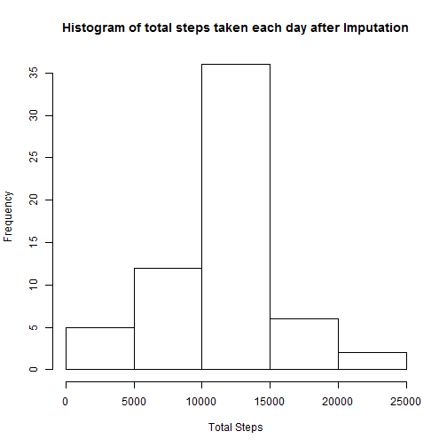

# Reproducible Research: Peer Assessment 1
This is the first peer assessment part of "Reproducible Research" course from Coursera. One has to complete the entire assignment in a single R markdown document that can be processed by knitr package and be transformed into an HTML file.

This assignment makes use of data from a personal activity monitoring device. This device collects data at 5 minute intervals through out the day. The data consists of two months of data from an anonymous individual collected during the months of October and November, 2012 and include the number of steps taken in 5 minute intervals each day.

## Loading and preprocessing the data

### Loading the data

```r
original.df <- read.table(file="activity.csv", header=TRUE, sep=",", na.strings="NA", stringsAsFactors = FALSE)
```

### Preprocessing the data
Converting "date" variable in the dataset to Date format.

```r
original.df$date <- as.Date(original.df$date, "%Y-%m-%d")
```

## What is mean total number of steps taken per day?
Histogram of total number of steps taken each day

```r
total.steps.df <- aggregate(x=original.df$steps, by=list(original.df$date), FUN=sum, na.rm=TRUE)
hist(total.steps.df$x, main="Histogram of total steps taken each day", xlab="Total Steps")
```



Mean and Median of total number of steps taken per day

```r
mean.total.steps <- mean(total.steps.df$x)
median.total.steps <- median(total.steps.df$x)
```
Mean of total number of steps taken per day is 9354.2295082.

Median of total number of steps taken per day is 10395.

## What is the average daily activity pattern?
Time Series Plot

```r
average.steps.df <- aggregate(x=original.df$steps, by=list(interval=original.df$interval), FUN=mean, na.rm=TRUE)
plot(average.steps.df$interval, average.steps.df$x, type="l", main="Time Series Plot", xlab="5-Minute Interval", ylab="Average Number of Steps")
```



Maximum Number of Steps

```r
max.average.steps <- average.steps.df[which(average.steps.df$x==max(average.steps.df$x)),1]
```
The "835" interval contains the maximum number of average steps.

## Imputing missing values
Total Number of Missing Values

```r
total.na.rows <- nrow(subset(original.df, is.na(original.df$steps)))
```
There are 2304 rows with NAs.

Strategy for Filling Missing Values

```r
temp.df <- merge(x=original.df, y=average.steps.df, by="interval", sort=FALSE)
names(temp.df)[4] <- "average.steps"
temp.df$steps <- ifelse(is.na(temp.df$steps), temp.df$average.steps, temp.df$steps)
```
The missing values for steps variable are replaced by the mean for that 5-minute interval.

New Dataset Without Missing Values

```r
impuned.df <- temp.df[,c("steps", "date", "interval")]
impuned.df <- impuned.df[order(impuned.df[,2], impuned.df[,3]), ]
total.na.rows <- nrow(subset(impuned.df, is.na(impuned.df$steps)))
```
Now there are 0 rows with NAs.

Histogram of total number of steps taken each day after Imputation

```r
total.steps.impuned.df <- aggregate(x=impuned.df$steps, by=list(impuned.df$date), FUN=sum, na.rm=TRUE)
hist(total.steps.impuned.df$x, main="Histogram of total steps taken each day after Imputation", xlab="Total Steps")
```



Mean and Median of total number of steps taken per day after Imputation

```r
mean.total.steps <- mean(total.steps.impuned.df$x)
median.total.steps <- median(total.steps.impuned.df$x)
```
Mean of total number of steps taken per day after imputation is 1.0766189 &times; 10<sup>4</sup>.

Median of total number of steps taken per day after imputation is 1.0766189 &times; 10<sup>4</sup>.

The above values differ from the estimates from the first part of the assignment. After imputing the missing data, the mean and median has become equal.

## Are there differences in activity patterns between weekdays and weekends?
Creating New Factor Variable

```r
impuned.df$day.type <- as.factor(sapply(impuned.df$date, function(x) {if (weekdays(x) == "Saturday" | weekdays(x) == "Sunday") {"Weekend"} else {"Weekday"}}))
```

Time Series Plot

```r
average.steps.impuned.df <- aggregate(x=impuned.df$steps, by=list(day.type=impuned.df$day.type, interval=impuned.df$interval), FUN=mean, na.rm=TRUE)
xyplot(average.steps.impuned.df$x ~ average.steps.impuned.df$interval | average.steps.impuned.df$day.type, type="l", xlab="Interval", ylab="Number of Steps", layout=c(1,2))
```


